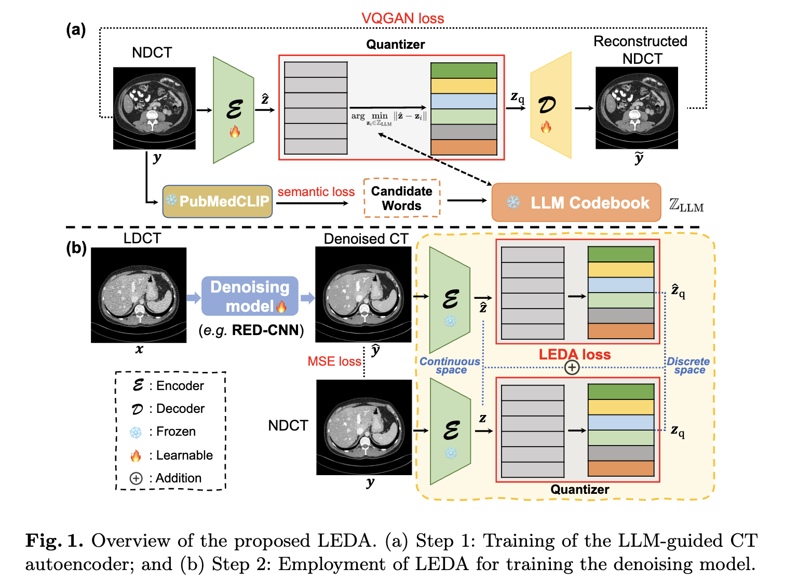

# LEDA
Official implementation of "Low-dose CT Denoising with Language-engaged Dual-space Alignment" [arxiv](https://arxiv.org/abs/2403.06128)


## Updates
May, 2024: initial commit.  

## Approach


## Data Preparation
The 2016 AAPM-Mayo dataset can be downloaded from: [CT Clinical Innovation Center](https://ctcicblog.mayo.edu/2016-low-dose-ct-grand-challenge/) (B30 kernel)  
The 2020 AAPM-Mayo dataset can be downloaded from: [cancer imaging archive](https://wiki.cancerimagingarchive.net/pages/viewpage.action?pageId=52758026)   
#### Dataset structre:
```
Mayo2016_2d/
  |--train/
      |--quarter_1mm/
        train_quarter_00001.npy
        train_quarter_00002.npy
        train_quarter_00003.npy
        ...
      |--full_1mm/
        train_full_00001.npy
        train_full_00002.npy
        train_full_00003.npy
        ...
  |--test/
      |--quarter_1mm
      |--full_1mm
```

## Requirements
```
- Linux Platform
- torch==1.12.1+cu113 # depends on the CUDA version of your machine
- torchvision==0.13.1+cu113
- Python==3.8.0
- numpy==1.22.3
```

## Traning and & Inference

Training of LLM-guided NDCT autoencoder:  we used the official repository of VQ-GAN (https://github.com/CompVis/taming-transformers) to set up training. Please refer to (models/taming) learn about our modifications to original VQ-GAN.

Employment of LEDA for training the denoising model  
```
python train.py  --name LEDA(experiment_name)   --model LEDA  --netG  redcnn  --dataroot /data/zhchen/Mayo2016_2d(path to images) --lr 0.0002 --gpu_ids 6,7 --print_freq 25 --batch_size 8 --lr_policy cosine
```

Inference & testing
```
python test.py  --name LEDA(experiment_name)   --model LEDA  --netG redcnn --results_dir test_results --result_name LEDA_results(path to save image)   --gpu_ids 6 --batch_size 1 --eval
```
Please refer to options files for more setting.


## Citation
If you find our work and code helpful, please kindly cite the corresponding paper:
```
@article{chen2024low,
  title={Low-dose CT Denoising with Language-engaged Dual-space Alignment},
  author={Chen, Zhihao and Chen, Tao and Wang, Chenhui and Niu, Chuang and Wang, Ge and Shan, Hongming},
  journal={arXiv preprint arXiv:2403.06128},
  year={2024}
}
```
